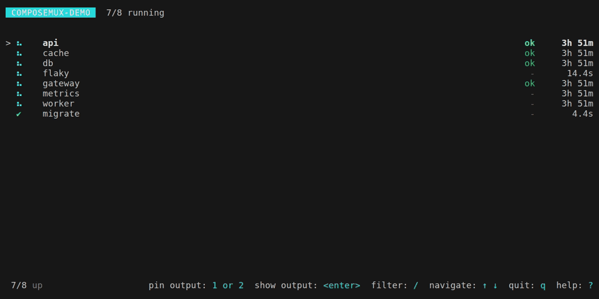

# composemux

Six services, one interleaved stream, and the stack trace you actually needed
has already scrolled off the top. `docker compose logs -f` shows you everything
at once and gives you no way to say "keep the API in front of me while I poke at
the others."

composemux does exactly that one thing: your services down the left with live
status, and up to two log panes you can pin open.

It is **read-only, on purpose.** It attaches to containers something else
already started and never starts, stops, restarts, or execs into anything — so
it is safe to drop into the middle of a script that owns `compose up` and
`compose down`.

<p align="center">
  
</p>

<p align="center"><sub>Recorded against the <a href="demo/">demo stack</a> in this repository; <code>demo/record</code> reproduces it.</sub></p>

## What it does

- **A service list with live status** — running, exited clean, exited non-zero,
  unhealthy, paused — with health and uptime columns.
- **Pin one or two services** so they stay on screen while you browse the rest.
- **Real container state**, read from the Docker Engine API rather than scraped
  out of `docker compose logs`: actual statuses, actual exit codes, and a
  reattach when a container restarts under a new ID.
- **Output that renders properly.** ANSI colour, `\r` progress bars, and
  forty-line Java stack traces all go through a vt100 emulator first.
- **Copy that survives SSH** — `c` copies the focused pane via OSC 52.
- **Sensible behaviour when nobody's watching.** Piped or in CI, it drops the UI
  and streams plain prefixed lines instead of a screenful of escape codes.

## Install

With a Rust toolchain (MSRV 1.88):

```sh
cargo install composemux
```

No toolchain? On Linux or Apple Silicon macOS:

```sh
curl -fsSL https://raw.githubusercontent.com/sofired/composemux/main/install.sh | sh
```

Or grab a prebuilt archive from the
[Releases page](https://github.com/sofired/composemux/releases) — Linux x86-64
(gnu and musl), Linux aarch64 (gnu), Apple Silicon macOS, and Windows x86-64,
each with a matching `.sha256`.

**One macOS gotcha, archives only** (the installer above avoids it): the macOS
build is ad-hoc signed, not notarized, so an archive downloaded in a browser and
unzipped in Finder gets quarantined and Gatekeeper kills it **silently**.
Extract from the terminal instead — `tar xzf composemux-*.tar.gz` — or clear the
flag after the fact with `xattr -d com.apple.quarantine ./composemux`.

Or build from source:

```sh
cargo build --release        # target/release/composemux
# or straight onto your PATH from a checkout:
cargo install --path .
```

## Use

Run it in a directory with a running Compose project:

```sh
composemux
```

Or name the project, which is what you want when a script is doing the
launching:

```sh
composemux --project my-stack --pin api --pin worker
```

### Options

| Flag | Meaning |
|---|---|
| `-p, --project <NAME>` | Compose project to attach to. Defaults to `$COMPOSE_PROJECT_NAME`, else the directory name. |
| `-c, --config <PATH>` | Config file. Defaults to the nearest `.composemux.yaml`. |
| `--pin <SERVICE>` | Pin a service to an output pane at startup. Repeatable, max two. |
| `--tail <N>` | Lines of history to load per service before following. |
| `--scrollback <N>` | Rows of output retained per service (default 1000, ~7 MB each). |
| `--no-tui` | Stream plain prefixed lines instead of the full-screen UI. |

## Keys

Press `?` for the whole list in-app. For the skimmers:

**In the service list**

| Key | Action |
|---|---|
| `↑` `↓` / `k` `j` | Move the selection |
| `1` / `2` | Pin the selected service to output pane 1 or 2 |
| `0` | Close every pane |
| `space` | Open a single pane that follows the selection |
| `enter` | Open the selected service's pane and focus it |
| `tab` / `shift+tab` | Move focus between the list and the panes |
| `b` | Hide or show the service list |
| `m` | Switch between stacked and side-by-side layouts |
| `/` | Filter services; `enter` confirms, `esc` clears |

Pinning is idempotent in the way you'd hope: pressing `1` or `2` on a service
already in that pane unpins it, and pinning something sitting in the *other*
pane moves it across rather than opening a second copy of the same logs.

Full screen is a stronger version of `b`: hiding the list still leaves two
pinned panes splitting the frame, whereas `enter` on a focused pane gives it the
whole frame. It's modal while it lasts — keys that would restore the list or the
other pane are ignored — and `esc` puts the arrangement back exactly as it was,
hidden list included. Press `esc` again for the service list, unless you had
hidden it with `b`, in which case it stays hidden.

**In an output pane**

| Key | Action |
|---|---|
| `↑` `↓` / `k` `j` | Scroll — accelerates while held |
| `ctrl+u` / `ctrl+d` | Scroll half a page |
| `Home` / `End` | Jump to the start or end |
| `c` | Copy the buffer to the clipboard |
| `enter` | Full screen: this pane takes the frame, list and all |
| `esc` | Leave full screen if it's on, otherwise back to the service list |

**Anywhere:** `?` help · `q` quit · `ctrl+c` interrupt · `F10` toggle mouse
capture.

Scroll up to read something and it stays put as new output arrives, rather than
drifting off the top. It only moves once the lines you're looking at fall out of
the buffer entirely — `scrollback`, 1000 rows by default. Raise it to hold a
position longer; it costs roughly 7 MB per service per 1000 rows.

Copy sends an OSC 52 escape sequence, handing the buffer straight to your
terminal emulator — so it works when composemux is running on a remote box over
SSH, with nothing installed at that end. Default builds also make a best-effort
write to the native clipboard, for terminals that ignore OSC 52; that second
path is what `--no-default-features` drops.

## Configuration

Entirely optional. Drop a `.composemux.yaml` next to your compose file:

```yaml
project: my-stack       # usually passed as --project instead
include: [api, worker]  # empty means every service
exclude: [migrate]
pinned:  [api, db]      # pane 1 and pane 2 at startup
tail: 200               # lines of history per service
scrollback: 1000        # rows retained per service (~7 MB each)
auto_exit: 3            # seconds to wait once every service has exited cleanly; false disables
```

| Key | Meaning |
|---|---|
| `project` | Compose project name. Usually passed as `--project` instead. |
| `include` | Services to show. Empty means all of them. |
| `exclude` | Services to hide, applied after `include`. |
| `pinned` | Up to two services, opened in panes 1 and 2 at startup. |
| `tail` | Lines of history loaded per service before following. |
| `scrollback` | Rows of output retained per service. |
| `auto_exit` | Seconds to wait once every service has exited cleanly, or `false` to disable. |

Without `--config`, composemux looks for `.composemux.yaml` in the working
directory and each parent above it, then falls back to a user config file
(`$XDG_CONFIG_HOME/composemux/config.yaml`, or `~/.config` on Linux and macOS,
`%APPDATA%` on Windows). A missing file isn't an error — it just runs with
defaults. Unknown keys are rejected rather than ignored, so a typo gets you a
loud error instead of a pin that quietly never happens.

## Driving it from a script

composemux is built to sit inside a wrapper that owns the Compose lifecycle:
bring the project up, block on the TUI, tear down when it exits. What matters to
that caller:

- **Exit codes.** `0` when the user quits with `q` or the stack exits on its
  own, `130` on `ctrl+c`, non-zero on error — so the wrapper can tell a
  deliberate quit from an interrupt.
- **Terminal restoration** runs on every exit path, panics and
  `SIGTERM`/`SIGHUP` included. Your script never inherits a terminal stuck in
  raw mode.
- **Non-TTY output** falls back to plain prefixed lines automatically, so a
  piped run doesn't write escape sequences into a log file.
- **Auto-exit.** Once every service has exited *cleanly*, a countdown appears
  and composemux closes so the wrapper can clean up; any keypress cancels it. If
  any service exited non-zero the countdown doesn't run at all — the moment
  after a crash is the worst possible time for your log viewer to disappear and
  let a script tear down the evidence.

One caveat: invoke the binary directly rather than through a task runner that
captures child output. A TUI nested inside another TUI renders neither.

## How it works

Logs come from the Docker Engine API, not from parsing `docker compose logs`
output — that's what buys the per-service streams, the real statuses, and the
exit codes. A supervisor watches Docker events, so a container that restarts
(and gets a new ID) is picked back up, and services created after startup show
up on their own.

If a log stream drops while its container keeps running (a daemon restart, say),
reconnecting resumes from a one-second boundary, the finest resolution the
Engine API offers here. A couple of already-visible lines can reappear as a
result — the deliberate trade: a duplicated line beats a missing one.

If the daemon stops answering, composemux keeps retrying rather than exiting,
and the status bar says which way it's failing, since the three point you
somewhere different:

- `Docker daemon unreachable - retrying` — nothing was reached. Start Docker.
- `Docker daemon not answering - retrying` — the request was taken and never
  came back. Docker is running but wedged; restarting composemux won't help.
- `Docker daemon rejected the request - retrying` — refused rather than lost.
  Run with
  `COMPOSEMUX_DEBUG=1` and the actual error lands in `composemux.log` in your
  temp directory.

Statuses and logs hold at their last known values until the daemon answers
again, at which point the note clears itself. It takes a short run of failed
polls to appear, so a single dropped request never flashes it. (Startup has no
status bar yet, so a daemon that goes quiet during connect prints to stderr
after five seconds — including which `DOCKER_HOST` it's waiting on — and keeps
waiting; a daemon still coming up is a normal thing for a wrapper to race.)

Everything then passes through a `vt100` terminal emulator before it reaches the
screen, which is why colour, cursor movement, and progress bars behave rather
than smearing across the UI. It's also a safety property: container logs are
untrusted input, and they're never handed to your terminal verbatim.

## Good to know

A `tty: true` service that writes without a trailing newline can look stalled;
set `tty: false` and it streams as it should
([#38](https://github.com/sofired/composemux/issues/38) has the mechanism — it's
upstream, in how Docker frames tty log output).

## Contributing

Contributions are welcome. [CONTRIBUTING.md](CONTRIBUTING.md) covers setup, the
test conventions, and one constraint worth two minutes before you spend an
afternoon on a keybinding: composemux's interaction model is adapted from the
[Nx terminal UI](https://nx.dev/blog/nx-21-terminal-ui), and matching it is
deliberate rather than incidental.

By participating you agree to the [Code of Conduct](CODE_OF_CONDUCT.md). For
security issues, please report privately — see [SECURITY.md](SECURITY.md) —
rather than opening an issue.

## Attribution

composemux's terminal UI — its layout, pinning model, colours, and keys — is
adapted from the Nx terminal UI, which is MIT licensed and copyright 2017-2026
Narwhal Technologies Inc. The full upstream notice is in
[LICENSE-THIRD-PARTY](LICENSE-THIRD-PARTY), and modules derived from Nx name
their upstream file in a header comment. If you already use the Nx TUI, the keys
and layout here are the same on purpose.

composemux is an independent project. It is **not affiliated with, endorsed by,
or sponsored by Nrwl / Nx.**

## License

MIT — see [LICENSE](LICENSE).

Contributions are accepted under the same licence (inbound = outbound). You keep
the copyright in your own work; there is no CLA.
